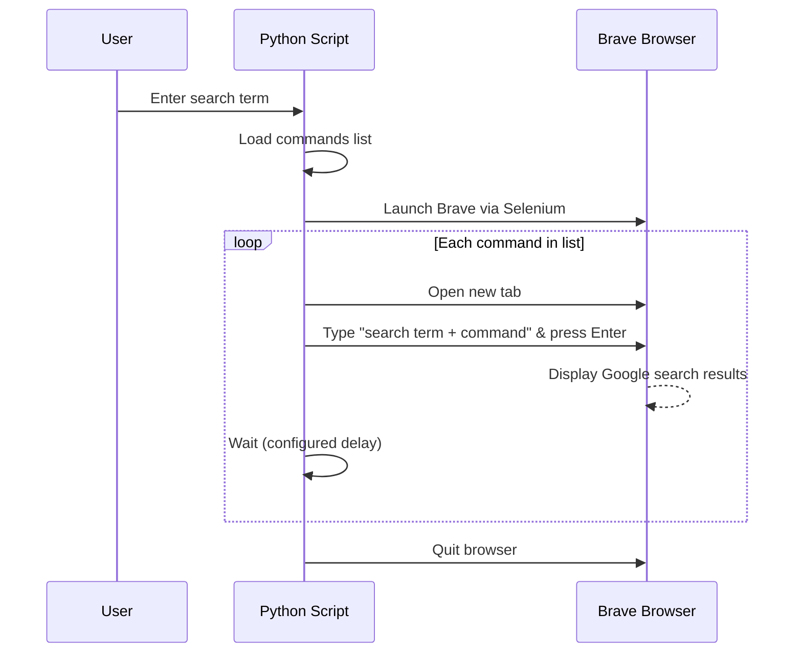

# Brave Multi-Tab Google Search Automation

A small Python + Selenium script that automates Google searches in the **Brave** browser.

You enter one search term (for example `GPT-3`). The script combines it with a list of preloaded "commands" (extra keywords such as `official documentation` or `pricing`), then opens **one tab per command**, types the query into Google's search box so you can watch it happen, and presses Enter.

```text
GPT-3 + official documentation  ->  tab 1
GPT-3 + GitHub repository       ->  tab 2
GPT-3 + latest news             ->  tab 3

```

## Features

- Prompts for the search term when you run it
- Reads commands from `commands.txt`, or falls back to a built-in list
- Drives Brave through Selenium and ChromeDriver (Brave is Chromium-based)
- One tab per search, with the query typed character by character
- Finds Brave automatically on Windows, macOS and Linux (or set `BRAVE_PATH`)
- Configurable delays, progress logging and clear error messages

## Project layout

```text
.
├── code.py          # the script
├── commands.txt     # optional: one command per line
├── chromedriver     # optional: chromedriver.exe on Windows
└── README.md
```

## Requirements

- **Python 3.x** (3.8 or newer recommended)
- **Selenium 4.x** (`pip install selenium`)
- **Brave Browser**
- **ChromeDriver** whose major version matches Brave's Chromium major version

## Installation

### 1. Install Python and Selenium

Install Python 3 from [python.org](https://www.python.org/downloads/), Homebrew (`brew install python`) or your Linux package manager, then:

```bash
python3 -m pip install selenium
```

On Windows, use `py -m pip install selenium` if `python3` isn't recognised.

### 2. Install Brave

Install [Brave](https://brave.com/download/). The script checks the usual locations on its own:

| Operating system | Brave executable (default location)                                   | ChromeDriver placement                                                                  |
|------------------|------------------------------------------------------------------------|-----------------------------------------------------------------------------------------|
| **Windows 10/11**| `C:\Program Files\BraveSoftware\Brave-Browser\Application\brave.exe`   | `chromedriver.exe` on your `PATH`, or in the same folder as `code.py`                    |
| **macOS**        | `/Applications/Brave Browser.app/Contents/MacOS/Brave Browser`         | `chromedriver` in `/usr/local/bin`, or next to `code.py` (see Troubleshooting for Gatekeeper) |
| **Linux**        | `/usr/bin/brave-browser`                                               | `chromedriver` in `/usr/local/bin`, or next to `code.py`; run `chmod +x chromedriver`    |

If Brave is installed somewhere else, set `BRAVE_PATH` at the top of `code.py`.

### 3. Get a matching ChromeDriver

1. In Brave, open `brave://version` (or **Menu -> About Brave**) and note the **Chromium** version, e.g. `110.0.5481.177`.
2. Download the ChromeDriver with the **same major version** (`110.x` in this example):
   - Chromium 115 and newer: [Chrome for Testing](https://googlechromelabs.github.io/chrome-for-testing/)
   - Chromium 114 and older: [chromedriver.chromium.org/downloads](https://chromedriver.chromium.org/downloads)
3. Unzip it and put `chromedriver` on your `PATH`, or next to `code.py` (the script picks it up automatically), or point `CHROMEDRIVER_PATH` at it.

> **Tip:** Selenium 4.6+ ships with *Selenium Manager*, which can sometimes download a matching driver for you, so you may be able to skip this step. If Brave fails to start with a driver error, download one manually as above. The [`webdriver_manager`](https://pypi.org/project/webdriver-manager/) package is another option.
>
> Brave updates often. If the script suddenly stops working after an update, an out-of-date ChromeDriver is the first thing to check.

### Checklist

- [ ] Brave is installed
- [ ] Python 3 and Selenium are installed
- [ ] ChromeDriver's major version matches Brave's Chromium version
- [ ] ChromeDriver is on `PATH`, next to `code.py`, or set in `CHROMEDRIVER_PATH`

## Usage

```bash
python code.py
```

You'll be asked for a search term. Brave opens, and for each command in the list it opens a tab, types `<search term> <command>` into Google and presses Enter. When the last search is done, press Enter in the terminal to close Brave.

### Custom commands

Create a `commands.txt` next to `code.py`, one command per line. Blank lines and lines starting with `#` are ignored.

```text
# my commands
official website
official documentation
GitHub
reddit
```

Without this file (or if it's empty) the built-in list is used: `official documentation`, `GitHub repository`, `latest news`, `tutorial`, `features`, `pricing`, `API examples`, `security`.

### Example run

```text
$ python code.py
What do you want to search? GPT-3
12:00:01 INFO: Search term: GPT-3
12:00:01 INFO: Using the default list of 8 commands
12:00:01 INFO: Using Brave at: /usr/bin/brave-browser
12:00:03 INFO: [1/8] Searching for: GPT-3 official documentation
12:00:12 INFO: [2/8] Searching for: GPT-3 GitHub repository
...
12:01:12 INFO: [8/8] Searching for: GPT-3 security
12:01:21 INFO: All searches completed.
Press Enter to close Brave...
```

## Configuration

All settings are constants near the top of `code.py`.

| Setting             | Default                    | What it does                                                                      |
|---------------------|----------------------------|-----------------------------------------------------------------------------------|
| `BRAVE_PATH`        | `None`                     | Full path to Brave. `None` means auto-detect                                      |
| `CHROMEDRIVER_PATH` | `None`                     | Full path to ChromeDriver. `None` means use one next to the script, else `PATH`   |
| `COMMANDS_FILE`     | `"commands.txt"`           | Optional file of commands, looked up next to the script                           |
| `DEFAULT_COMMANDS`  | 8 built-in phrases         | Used when the commands file is missing or empty                                   |
| `GOOGLE_URL`        | `"https://www.google.com"` | Where each search starts (use a country-specific Google domain if you prefer)     |
| `PAGE_DELAY`        | `1.0`                      | Seconds to pause after Google loads, before typing starts                         |
| `TYPE_DELAY`        | `0.08`                     | Seconds between keystrokes. Set to `0` to type instantly                          |
| `SEARCH_DELAY`      | `3.0`                      | Seconds the results stay on screen before the next tab opens                      |
| `ELEMENT_TIMEOUT`   | `20`                       | Longest wait, in seconds, for Google's search box to appear                       |

## How it works



1. **Launch:** `ChromeOptions.binary_location` points Selenium at Brave's executable instead of Chrome.
2. **Tabs:** the first command uses the tab Brave opens with. Each later command calls `driver.switch_to.new_window("tab")`.
3. **Search:** in each tab the script loads Google, waits for the search box (`name="q"`), types the query one character at a time, and presses Enter.
4. **Pause:** it waits `SEARCH_DELAY` seconds so you can see the results, then moves on.
5. **Cleanup:** after the last search it waits for you to press Enter, then calls `driver.quit()`.

## Troubleshooting

- **`This version of ChromeDriver only supports Chrome version X`**: ChromeDriver and Brave's Chromium version don't match. Check `brave://version` and download the matching driver.
- **`Could not find the Brave executable`**: set `BRAVE_PATH` to the full path of Brave. On macOS the path includes spaces and capital letters, so copy it exactly.
- **Permission denied (Linux/macOS)**: run `chmod +x chromedriver`.
- **macOS says ChromeDriver "cannot be opened because the developer cannot be verified"**: clear the quarantine flag with `xattr -d com.apple.quarantine chromedriver`.
- **`Search box not found` warnings**: Google is probably showing a cookie-consent or CAPTCHA page. Deal with it by hand in the browser; the script waits up to `ELEMENT_TIMEOUT` seconds before skipping that command. If Google changes its page layout, update the locator in `run_search()` (for example, switch to a CSS selector). `name="q"` is the standard one.
- **Searches feel too fast or too slow**: tune `PAGE_DELAY`, `TYPE_DELAY` and `SEARCH_DELAY`. Google may challenge rapid-fire queries, so longer delays help.
- **Headless mode**: the script deliberately runs with a visible browser. Google often blocks searches from headless browsers.
- **Odd import errors mentioning `code`**: `code` is also the name of a Python standard-library module. If you hit errors like `module 'code' has no attribute ...`, rename `code.py` (for example to `brave_search.py`).

## Notes

Google may throttle or challenge automated traffic, and automated querying can conflict with its terms of service. Keep this to light, personal use and leave the delays generous.

## Resources

- [Selenium documentation](https://www.selenium.dev/documentation/)
- [Chrome for Testing (ChromeDriver downloads)](https://googlechromelabs.github.io/chrome-for-testing/)
- [webdriver_manager on PyPI](https://pypi.org/project/webdriver-manager/)
